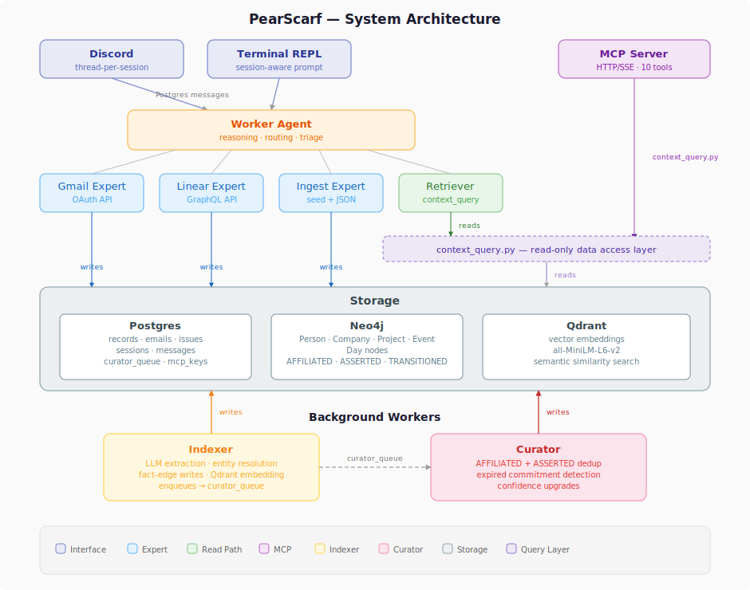

# Architecture

## System Diagram

<p align="center"></p>

<details>
<summary>Text fallback</summary>

```
┌─────────────────────────────────────────────────────────┐
│                    Interfaces                            │
│       Discord / Terminal REPL / MCP Server (HTTP/SSE)    │
└────────────┬──────────────────────────┬─────────────────┘
             │ Postgres messages         │ context_query.py
┌────────────▼──────────────────────────┐│
│            Worker Agent                ││
│   (reasoning, routing, triage)         ││
└──┬──────┬──────┬──────┬───────────────┘│
   │      │      │      │               │
┌──▼──┐┌──▼──┐┌──▼───┐┌─▼────┐  ┌──────▼──────┐
│Gmail││Linear││GitHub││Retrvr│  │ MCP Server  │
│scarf││scarf ││scarf ││      │  │ (10 tools)  │
└──┬──┘└──┬──┘└──┬───┘└──┬───┘  └──────┬──────┘
   │      │      │       │             │
   │writes│writes│writes │reads        │reads
   │      │      │       │             │
┌──▼──────▼──────▼───────▼─────────────▼──────┐
│                  Storage                     │
│  ┌──────────┐ ┌──────────┐ ┌──────────────┐ │
│  │ Postgres │ │ Neo4j    │ │ Qdrant       │ │
│  │ records  │ │ entities │ │ vectors      │ │
│  │ typed    │ │ fact-    │ │              │ │
│  │  tables  │ │ edges    │ │              │ │
│  │ sessions │ │          │ │              │ │
│  └──────────┘ └──────────┘ └──────────────┘ │
└──────────────────────────────────────────────┘
        ↑ writes              ↑ writes
┌───────┴──────┐     ┌───────┴──────┐
│   Indexer    │────→│   Curator    │
│ (extraction) │queue│ (dedup,      │
│              │     │  expiry,     │
│              │     │  confidence) │
└──────────────┘     └──────────────┘
```
</details>

## Expert Architecture

Experts are self-contained plugin packages that live in `experts/`. Each expert owns two-way access to a single data source (Gmail, Linear, GitHub). PearScarf loads them at startup via the registry and routes records through them at runtime. Today experts run as daemon threads inside PearScarf's process; running experts as standalone processes outside the runtime is on the roadmap.

### Expert package structure

```
experts/gmailscarf/
├── manifest.yaml          # name, version, record_types, schemas, tools, ingester
├── gmail_connect.py       # API client + tool definitions + ingest_record()
├── gmail_ingest.py        # background polling loop: start(ctx)
├── schemas/
│   └── email.json         # JSON Schema (draft-07) for the email record type
├── knowledge/
│   ├── agent.md           # LLM agent system prompt
│   ├── extraction.md      # Layer 3 extraction guidance
│   ├── entities/          # new entity type definitions (if any)
│   └── records/
│       └── email.md       # record type documentation
├── .env.example           # required credentials template
└── pyproject.toml
```

### ExpertContext

Every agent — expert or internal — receives an `ExpertContext` at startup. It's the entire surface area experts are given:

- **`ctx.storage`** — `save_record(type, raw, content, metadata, dedup_key)`, `get_record(id)`, `mark_relevant(id)`
- **`ctx.bus`** — `send(session_id, to_agent, content)`, `create_session(summary)`
- **`ctx.log`** — `write(agent, event_type, message)`
- **`ctx.config`** — dict loaded from `env/.<expert_name>.env`
- **`ctx.expert_name`** — the expert's registered name

Experts do not import pearscarf internals. The context is the contract.

### Startup flow

`start_system()` in `pearscarf/interface/startup.py` boots the entire system:

```
1. enforce_credentials_or_exit()     — validate env files for all enabled experts
2. For each enabled expert:
   a. build_context()                — load env/.<name>.env, create ExpertContext
   b. Load tools module              — get_tools(ctx) → connect instance, cached by record_type
   c. Start LLM agent                — if tools + knowledge/agent.md exist → AgentRunner
   d. Start ingester                 — if --poll and ingester_module exists → start(ctx)
3. Start internal agents             — retriever, worker
4. Start indexer
5. Start MCP server
```

Both `psc run` (REPL) and `psc discord` call `start_system()` then run their frontend.

### Registry

The registry discovers installed experts from the `experts` DB table and builds runtime indexes:

- `get(source_type)` → expert
- `get_by_record_type(record_type)` → expert
- `get_connect(record_type)` → cached connect instance
- `core_prompt()` → Layer 1 extraction rules (cached)
- `schema_fragment()` → Layer 2 entity types including expert-declared types (cached)
- `compose_prompt(record)` → Layer 1 + Layer 2 + Layer 3

### Prompt composition

```
Layer 1: core/extraction.md + core/facts.md + core/output_format.md
         → universal rules, never changes

Layer 2: core/entities/*.md + expert-declared entity files
         → entity type definitions (person, company, project, event, repository, ...)

Layer 3: {expert}/knowledge/extraction.md
         → source-specific guidance (what to extract from emails vs issues vs PRs)
```

### Install and lifecycle

```bash
psc install ./experts/githubscarf    # 7-stage validation, typed tables, credential scaffold
psc update githubscarf               # version bump, re-validate, preserve history
psc expert list                      # show all installed experts
psc expert disable githubscarf       # stop without uninstalling
psc expert enable githubscarf        # restart
psc expert uninstall githubscarf     # remove DB rows, keep graph data
```

## Overview

```
pearscarf/
├── storage/                # Persistence layer
│   ├── db.py               # Postgres schema + connection pool + queries
│   ├── store.py            # System of Record — generic save_record + typed tables
│   ├── graph.py            # Knowledge graph CRUD — entities, fact-edges, traversal
│   ├── neo4j_client.py     # Neo4j connection manager
│   └── vectorstore.py      # Qdrant vector storage — semantic search
├── indexing/
│   ├── indexer.py           # Background LLM extraction into knowledge graph
│   └── registry.py          # Expert registry — discovery, prompt composition, connect cache
├── curation/
│   ├── curator.py           # Background graph quality (dedup, expiry, confidence)
│   └── curator_judge.py     # LLM judge for semantic equivalence
├── query/
│   └── context_query.py     # Read-only data access layer for retriever + MCP
├── mcp/
│   └── mcp_server.py        # FastMCP over HTTP/SSE, 10 tools
├── agents/
│   ├── base.py              # BaseAgent — agentic loop on Anthropic SDK
│   ├── expert.py            # ExpertAgent — domain-specialized, receives ExpertContext
│   ├── worker.py            # Worker — routing, triage, human interface
│   └── runner.py            # AgentRunner — polls bus, dispatches to agents, caches per session
├── experts/
│   ├── ingest.py            # Ingest expert — file-based data entry (seed + JSON records)
│   └── retriever.py         # Retriever expert — context queries via context_query.py
├── expert_context.py        # ExpertContext + protocols (Storage, Bus, Log) + build_context()
├── tools/
│   ├── __init__.py          # BaseTool + ToolRegistry
│   ├── math.py              # Safe math expression evaluator
│   └── web_search.py        # DuckDuckGo web search
├── interface/
│   ├── cli.py               # Click CLI
│   ├── install.py           # Install command, validation pipeline, lifecycle commands
│   ├── startup.py           # Shared boot sequence for run + discord
│   ├── repl.py              # Non-blocking session-aware REPL
│   ├── terminal.py          # Raw terminal I/O
│   └── discord_bot.py       # Discord bot with thread-per-session
├── knowledge/               # Layered prompts for extraction, agents, curation
│   ├── core/                # Layer 1 + Layer 2 base entity types
│   ├── ingest/              # Ingest expert prompts
│   ├── entity_resolution/   # Resolution LLM judge prompt
│   ├── curator/             # Curator judge prompts
│   ├── retriever/           # Retriever agent prompt
│   └── worker/              # Worker agent prompt
├── eval/
│   ├── runner.py            # Eval pipeline
│   ├── report.py            # Report formatter
│   └── scoring.py           # Entity/fact matching, F1, NRR, ERA
├── bus.py                   # MessageBus — send/receive/poll over Postgres
├── config.py                # Loads from env/.env
├── log.py                   # Shared session logger
├── status.py                # In-memory agent activity registry
└── tracing.py               # LangSmith tracing utilities
```

## Agent Communication

All agent-to-agent communication goes through Postgres. No direct function calling between agents. Each agent runs in its own thread, polling for unread messages.

- **Worker** uses `send_message` to send to humans or experts (by package name: `gmailscarf`, `linearscarf`, `githubscarf`)
- **Experts** use `reply` to send results back to whoever requested work
- The runner never auto-replies — all outbound routing is the agent's decision

## Sessions

Every conversation is a **session** (`ses_001`, `ses_002`, ...). Messages are tagged with a session ID. The AgentRunner caches one agent instance per session and rebuilds message history from the DB before each LLM call.

- **Human-initiated**: human types in REPL or Discord → new session
- **Expert-initiated**: expert detects an event → creates session, notifies worker
- **Discord**: threads map to sessions via `discord_threads` table

## Database Schema

```sql
-- Communication
sessions(id, initiated_by, summary, created_at)
messages(id, session_id, from_agent, to_agent, content, reasoning, data, read, created_at)
discord_threads(session_id, thread_id, channel_id)

-- System of Record
records(id, type, source, created_at, raw, content, metadata JSONB,
        dedup_key, expert_name, expert_version, indexed, classification,
        classification_reason, human_context, resolution_pending, resolution_status)

-- Expert registration
experts(id, name, version, source_type, package_name, install_method, enabled, installed_at)
entity_types(expert_id, type_name, knowledge_path)
identifier_patterns(id, expert_id, pattern_or_field, entity_type, scope)
expert_record_schemas(expert_name, record_type, version, table_name, schema_hash, created_at)

-- Operations
curator_queue(record_id, queued_at, claimed_at)
mcp_keys(id, name, key_hash, created_at, last_used_at, revoked)
```

Expert-specific typed tables (e.g. `gmailscarf_email_0_1_3`, `linearscarf_linear_issue_0_1_4`) are created at install time from JSON schemas. Records are dual-written: generic `records` row + typed table row, joined by `record_id`.

Record IDs use `{type}_{uuid4_short}` format (e.g. `email_3f2a1b4c`).

## System of Record

- **`records`** — generic table for all record types. Every record has a `type`, `source`, `raw` (original data), `content` (LLM-ready string), `metadata` (JSONB), and `dedup_key`.
- **Typed tables** — per-expert, per-record-type, per-version. Created from JSON Schema at install. Columns match schema properties.
- **`store.save_record()`** — single write path used by all experts via `ctx.storage`. Handles dedup, ID generation, and dual-write to typed table.

### Triage

When an expert pushes a new record via the bus, the worker classifies it:

1. **Obvious noise** (no-reply, promotional, automated) → auto-classify as noise
2. **Uncertain** → ask the human "Is this relevant and why?"
3. **Human responds** → `classify_record` with reasoning

Records ingested via `psc expert ingest --record` are auto-marked relevant.

The indexer only processes records where `classification = 'relevant'`.

## Configuration

Core config loads from `env/.env`. Expert credentials load from `env/.<name>.env` via `build_context()`.

| Variable | Default | Source |
|---|---|---|
| `ANTHROPIC_API_KEY` | (required) | env/.env |
| `MODEL` | `claude-sonnet-4-5-20250929` | env/.env |
| `DISCORD_BOT_TOKEN` | (required for discord) | env/.env |
| `POSTGRES_*` | localhost defaults | env/.env |
| `NEO4J_*` | localhost defaults | env/.env |
| `QDRANT_URL` | `http://localhost:6333` | env/.env |
| `TIMEZONE` | `America/Los_Angeles` | env/.env |
| `MCP_PORT` / `MCP_HOST` | `8090` / `0.0.0.0` | env/.env |
| `GMAIL_*` | | env/.gmailscarf.env |
| `LINEAR_*` | | env/.linearscarf.env |
| `GITHUB_*` | | env/.githubscarf.env |

## Knowledge Graph

The indexer processes records into a knowledge graph. All graph data lives in Neo4j.

- **Entities** — nodes with labels (Person, Company, Project, Event, Repository). Merged on name + metadata. Aliases tracked via IDENTIFIED_AS self-edges.
- **Fact-edges** — AFFILIATED (organizational), ASSERTED (claims/commitments), TRANSITIONED (state changes). Each carries `fact_type`, `source_at`, `recorded_at`, `stale`, `confidence`, `valid_until`.

### Indexer

Background daemon polling `records WHERE indexed = FALSE AND classification = 'relevant'`. For each record:

1. Build content from `records.content` column
2. Load extraction prompt via `compose_prompt(record)` — Layer 1 + 2 + 3
3. LLM extraction → entities + facts
4. Entity resolution (exact → metadata → alias → LLM judge)
5. Write fact-edges to Neo4j
6. Embed content in Qdrant
7. Mark indexed, enqueue for curator

## Data Access

```
WRITE PATH                           READ PATH
                                     
Records (experts via ctx.storage)    Retriever (internal)
    ↓                                    ↓
Indexer → graph.py / vectorstore.py  context_query.py → graph.py
    ↓                                    ↑              store.py
curator_queue                        MCP Server        vectorstore.py
    ↓                                (external)
Curator → graph.py (stale, confidence)
```

`context_query.py` is the single read layer. Both the retriever and MCP server call through it.

## MCP Server

Read-only query surface via FastMCP over HTTP/SSE. 10 tools: 5 primitive + 5 convenience. API key auth. Starts as daemon thread in `psc run`/`psc discord` or standalone via `psc mcp start`.

## Interfaces

- **`psc run`** — full system + session REPL
- **`psc discord`** — full system + Discord bot (thread-per-session)
- **`psc run --poll` / `psc discord --poll`** — also starts expert ingesters
- **`psc expert ingest`** — standalone file-based ingestion
- **`psc chat`** — direct agent chat without the session bus
