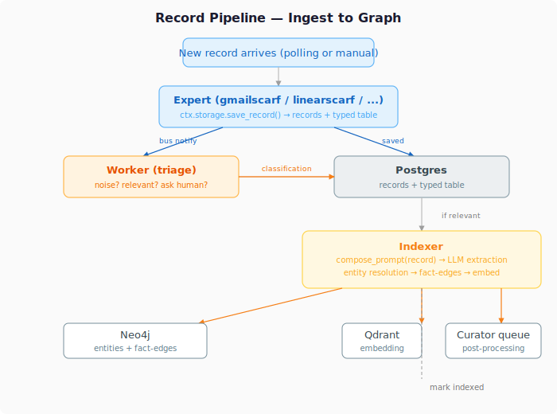

# Building an Expert

This guide walks through creating a new expert from scratch. We'll use `githubscarf` as the running example — it was the first expert built greenfield against the expert contract.

## What an expert is

An expert is two things:

**A connector** — an always-running process that owns two-way access to its data source. It manages polling, auth, and rate limits. It pushes records into PearScarf and can write back to the source when needed.

**A knowledge package** — natural language files that describe what the expert knows about its source: record types, entity types, how to extract facts, and how the LLM agent should behave.

## Package structure

```
experts/githubscarf/
├── __init__.py            # package docstring
├── manifest.yaml          # declares everything about the expert
├── pyproject.toml         # Python package metadata
├── .env.example           # required credentials template
├── github_connect.py      # API client + tools + ingest_record()
├── github_ingest.py       # background polling loop
├── schemas/
│   ├── github_pr.json     # JSON Schema for PR records
│   └── github_issue.json  # JSON Schema for issue records
├── knowledge/
│   ├── agent.md           # LLM agent system prompt
│   ├── extraction.md      # source-specific extraction guidance
│   ├── entities/
│   │   └── repository.md  # new entity type definition (optional)
│   └── records/
│       ├── github_pr.md   # PR record documentation
│       └── github_issue.md
└── eval/                  # evaluation dataset (optional)
```

## Step 1: Manifest

The manifest is the contract between the expert and PearScarf.

```yaml
name: githubscarf
version: 0.1.0
source_type: github
author: pearshape-ai
description: GitHub expert for PearScarf

relevancy_check: skip

record_types:
  - github_pr
  - github_issue

schemas:
  github_pr: schemas/github_pr.json
  github_issue: schemas/github_issue.json

dedup_key: github_id

new_entity_types:
  - name: repository       # omit if no new entity types

new_entity_types: []        # or empty list

identifier_patterns: []

tools: github_connect.py
ingester: github_ingest.py
eval: eval/
```

Key fields:
- **`relevancy_check`** — required. `skip` auto-marks every record relevant on save (use for internal/trusted sources). `required` means the expert owns classification: its `ingest_record` may run an internal hard filter and pass `classification="noise"` for unambiguous noise, or leave it unset to let the framework default to `pending_triage` so the triage agent can judge it. Required experts should also ship a `knowledge/relevancy.md` describing source-specific signal vs noise — the triage agent loads it into its LLM check.
- **`record_types`** — the record type strings this expert produces. Must be globally unique (prefix with source name to avoid collisions: `github_issue` not `issue`).
- **`schemas`** — maps each record type to a JSON Schema file. Used to create typed tables at install time.
- **`tools`** — module with `get_tools(ctx)` entry point. Called at startup.
- **`ingester`** — module with `start(ctx)` entry point. Called when `--poll` is active.
- **`new_entity_types`** — entity types not in the base schema. Operator approves on install.

## Step 2: Schemas

One JSON Schema (draft-07) per record type. Properties become columns in the typed table.

```json
{
  "$schema": "http://json-schema.org/draft-07/schema#",
  "type": "object",
  "properties": {
    "github_id": {"type": "integer"},
    "number": {"type": "integer"},
    "title": {"type": "string"},
    "body": {"type": "string"},
    "state": {"type": "string"},
    "author": {"type": "string"},
    "url": {"type": "string"},
    "created_at": {"type": "string"},
    "updated_at": {"type": "string"}
  },
  "required": ["github_id", "number", "title"]
}
```

## Step 3: Connect module

The connect module is the core of the expert. It provides:

1. **API client** — wraps the data source's API
2. **`ingest_record(data)`** — saves a record via `ctx.storage.save_record()`
3. **`get_tools()`** — returns `BaseTool` instances for the LLM agent
4. **Module-level `get_tools(ctx)`** — entry point called by PearScarf at startup

```python
from __future__ import annotations
from typing import TYPE_CHECKING, Any
from pearscarf.tools import BaseTool

if TYPE_CHECKING:
    from pearscarf.expert_context import ExpertContext


class GitHubConnect:
    def __init__(self, ctx: ExpertContext) -> None:
        self._ctx = ctx
        self._token = ctx.config.get("GITHUB_TOKEN", "")
        self._repo = ctx.config.get("GITHUB_REPO", "")

    def ingest_record(self, data: dict) -> str | None:
        """Save a record. Returns record_id or None on duplicate."""
        raw = json.dumps(data)
        content = f"Issue #{data['number']}: {data['title']}\n..."
        metadata = {"github_id": data["github_id"], ...}
        return self._ctx.storage.save_record(
            "github_issue", raw, content=content, metadata=metadata,
            dedup_key=str(data["github_id"]),
        )

    def get_tools(self) -> list[BaseTool]:
        return [MyTool(self), ...]


# Module entry point — pearscarf calls this at startup
def get_tools(ctx: ExpertContext) -> GitHubConnect:
    return GitHubConnect(ctx)
```

### ExpertContext

The context is everything the expert receives. No pearscarf internals.

- **`ctx.storage.save_record(type, raw, content, metadata, dedup_key)`** — save a record. `raw` = original data, `content` = LLM-ready string, `metadata` = structured fields as dict.
- **`ctx.storage.get_record(id)`** — look up a record
- **`ctx.storage.mark_relevant(id)`** — mark a record for extraction
- **`ctx.bus.send(session_id, to_agent, content)`** — send a message
- **`ctx.bus.create_session(summary)`** — create a new session
- **`ctx.log.write(agent, event_type, message)`** — log an event
- **`ctx.config`** — dict from `env/.<name>.env`
- **`ctx.expert_name`** — the expert's registered name

### Tools

Tools are `BaseTool` subclasses with `name`, `description`, `input_schema`, and `execute()`:

```python
class GitHubListIssuesTool(BaseTool):
    name = "github_list_issues"
    description = "List issues from the GitHub repository."
    input_schema = {
        "type": "object",
        "properties": {
            "state": {"type": "string", "enum": ["open", "closed", "all"]},
        },
    }

    def __init__(self, connect: GitHubConnect) -> None:
        self._connect = connect

    def execute(self, **kwargs: Any) -> str:
        issues = self._connect.list_issues(state=kwargs.get("state", "open"))
        if not issues:
            return "No issues found."
        return "\n".join(f"- #{i['number']}: {i['title']}" for i in issues)
```

## Step 4: Ingester module

The ingester runs as a daemon thread when `--poll` is active. It must expose `start(ctx)`.

```python
from __future__ import annotations
import threading, time
from typing import TYPE_CHECKING

if TYPE_CHECKING:
    from pearscarf.expert_context import ExpertContext


def start(ctx: ExpertContext) -> None:
    from githubscarf.github_connect import GitHubConnect

    connect = GitHubConnect(ctx)
    interval = int(ctx.config.get("GITHUB_POLL_INTERVAL", "300"))

    def _loop():
        while True:
            try:
                issues = connect.list_issues()
                for issue in issues:
                    rid = connect.ingest_record(issue)
                    if rid:
                        session_id = ctx.bus.create_session(f"New issue #{issue['number']}")
                        ctx.bus.send(session_id=session_id, to_agent="worker",
                                     content=f"New issue: {issue['title']}\nRecord: {rid}")
            except Exception as exc:
                ctx.log.write(ctx.expert_name, "error", f"Poll failed: {exc}")
            time.sleep(interval)

    thread = threading.Thread(target=_loop, daemon=True, name="githubscarf-ingest")
    thread.start()
```

## Step 5: Knowledge files

### `knowledge/agent.md`

System prompt for the LLM agent. Tells it what tools are available and how to behave:

```markdown
You are a GitHub expert agent. You access GitHub through the REST API.

Your job is to manage pull requests and issues — list, read, search as requested.

IMPORTANT: Use the reply tool to send results back. Your text responses
are only logged internally.
```

### `knowledge/extraction.md`

Source-specific extraction guidance — tells the Extraction consumer what to extract from this source's records and what to ignore. PearScarf automatically combines this with its universal extraction rules and entity type definitions when processing your records:

```markdown
## GitHub extraction guidance

Extract from the body, not metadata fields. Look for decisions,
blockers, people mentioned by name. Ignore bot comments and
template boilerplate.
```

### `knowledge/entities/*.md` (optional)

Only needed if the expert introduces new entity types. Each file defines one type:

```markdown
**repository**
A GitHub repository — a codebase with its own issues, PRs, and contributors.

Extract when: the record references a specific repo by name.
Do not extract when: "repository" is used generically.
```

### `knowledge/records/*.md`

Documents each record type's fields and identity rules. Not used in prompt composition — for human reference and agent context.

### `knowledge/relevancy.md` (required experts only)

Source-specific prose guidance for the triage agent. Describes what looks like signal, what looks like noise, and what should be flagged as uncertain for this expert's records. Loaded by the triage agent alongside the deployment onboarding when classifying `pending_triage` records.

```markdown
Relevancy guidance for <source> records.

## Keep as relevant
- Direct human correspondence with a known sender or recipient
- Replies in an ongoing thread
- Messages referencing a known project or deal

## Discard as noise
- Marketing, newsletters, sales outreach past the hard filter
- Transactional system mail unrelated to operational work

## Flag as uncertain
- Unknown sender, personally written, no anchor in the world
- Anything where the signal is subtle
```

Skip experts don't need this file.

### Internal hard filter (required experts only)

Inside your connect class, add a method like `_is_noise(raw, metadata) -> bool` and call it in `ingest_record`. Pass `classification="noise"` to `save_record` on a hit; pass nothing (`None`) on a miss and the framework will default to `pending_triage`. Keep the filter deterministic and conservative — only flag unambiguous automated/bulk patterns. Everything borderline should pass through to the triage agent, which has world context the hard filter lacks.

## Step 6: Credentials

Ship a `.env.example` with required vars:

```
GITHUB_TOKEN=
GITHUB_REPO=
GITHUB_POLL_INTERVAL=300
```

On install, PearScarf copies this to `env/.githubscarf.env`. The operator fills in values. At startup, `build_context()` loads them into `ctx.config`.

## Step 7: Install and test

```bash
psc install ./experts/githubscarf
```

The install runs 7 validation stages:
1. Package locatable
2. Manifest valid
3. Knowledge contract (agent.md, extraction.md, entity files)
4. Entry points (tools module imports, ingester module imports)
5. Conflict checks (source_type unique, record_types not claimed)
6. Identifier patterns valid
7. Eval dataset (non-blocking warning if missing)

On success: DB rows created, typed tables created, credentials scaffolded.

```bash
# Fill in credentials
vi env/.githubscarf.env

# Verify
psc expert list
psc expert inspect githubscarf

# Run
psc run --poll
```

## What happens at runtime

<p align="center"></p>

1. **Startup** — `start_system()` calls `get_tools(ctx)` on your connect module. The returned connect instance is cached by record type. If `agent.md` exists, an `AgentRunner` starts for your expert.
2. **Polling** — if `--poll`, `start(ctx)` is called on your ingester module. Your polling loop runs as a daemon thread.
3. **Messages** — when the worker sends a message to your expert (by name), the `AgentRunner` dispatches it to your LLM agent with your tools.
4. **Ingestion** — your `ingest_record()` writes to the generic `records` table + your typed table. The worker triages the record (relevant/noise). The Extraction consumer picks up relevant records and extracts entities/facts using your `extraction.md`.

## See also

- [Architecture](architecture.md) — system design, startup flow, prompt composition
- [Getting Started](getting-started.md) — installation and first run
- [Data Model](data-model.md) — entities, facts, graph schema
